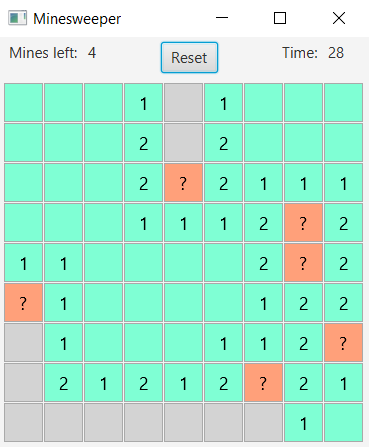

Polyglot Mine Sweeper
=====================

This repository contains multiple implementations of the well-known
hangman game. Its purpose is to serve as a playground to try new
languages and, at the same time, to be an interesting read for
those who want to compare the different approaches encouraged by
each paradigm.

Build instructions can be found in the directory for each language.

## Screenshot!

Of course, no readme is complete without a screenshot... This one is
from the Java project. All other versions are console based, so no
screenshots for them.

## Hey! Something is wrong in your code!

Then you can open a pull request. I promise I will look at it! Any nitpicks about style are welcome as well.
